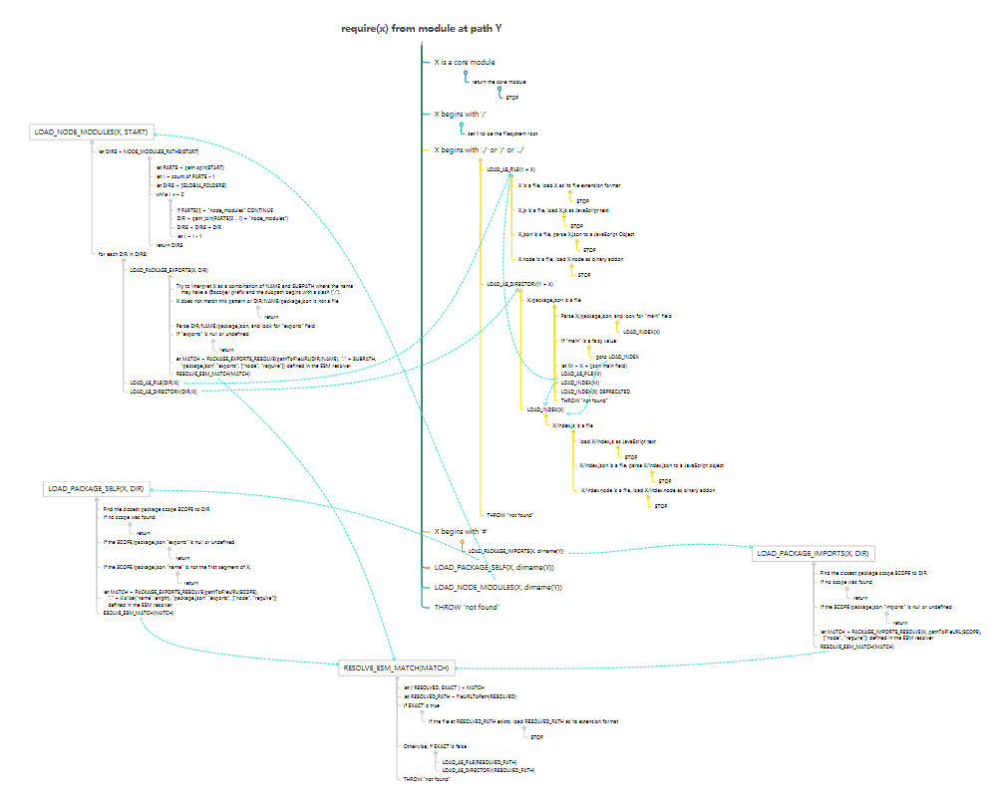

# 理解 CommonJS

## 前言

最近在看 nodejs，这篇文章的内容，绝大部分都是参考 [node文档](https://nodejs.org/docs/latest/api/modules.html) ，主要是帮助自己理解记忆相关知识点，同时也便于今后查阅。如果能帮助到其他朋友，那更是荣幸至极了。

在 nodejs 模块系统中，一个文件就是一个独立的模块。在模块中定义的变量都是私有的，模块要对外暴露对象或者方法，就在模块内的 `module.exports` 或者 `exports`上添加属性，然后在需要使用该模块的地方用 `require` 引入。

## 为什么模块内定义的变量是私有的？

模块内的代码在执行之前，会被放到函数中，因此其中的定义的变量都变成了局部变量。

```
(function(exports, require, module, __filename, __dirname) {
// Module code actually lives in here
});
```

## exports 和 module.exports

### module.exports

`module.exports` 是模块导出的对象。在 module 内，在 `module.exports` 上添加 props 或者直接赋值，都能顺利导出。

添加 props：

```
module.exports.hi = 'Hi'
module.exports.sayHi = function() { console.log('Hi!') }
```

直接赋值：

```
module.exports = {
	hi: 'Hi!'
}
```

```
module.exports = function() { console.log('Hi!') }
```

再贴一个将实例赋值给 `module.exports` ，并且在模块内触发事件的例子：

module：

```
const EventEmitter = require('events');

module.exports = new EventEmitter();

// Do some work, and after some time emit
// the 'ready' event from the module itself.
setTimeout(() => {
  module.exports.emit('ready');
}, 1000);
```

require：

```
const a = require('./a');
a.on('ready', () => {
  console.log('module "a" is ready');
});
```

注意：

`module.exports` 的赋值不能放在回调中（`exports` 也一样），这样是错的：

```
setTimeout(() => {
  module.exports = { a: 'hello' };
}, 0);
```
### exports

`exports` 是 module 内的一个变量，就如同写了一句：

```
exports = module.exports
```

因此，如果直接在 `exports` 或者 `module.exports` 上添加 props，其效果是一样的；但是如果直接给 `exports` 赋值，它就不再指向 `module.exports`，所以也无法暴露相应的值了。

正如 node 文档示例那样：

```
module.exports.hello = true; // Exported from require of module
exports = { hello: false };  // Not exported, only available in the module
```

## require

> To illustrate the behavior, imagine this hypothetical implementation of require(), which is quite similar to what is actually done by require().

```
function require(/* ... */) {
  const module = { exports: {} };
  ((module, exports) => {
    // Module code here. In this example, define a function.
    function someFunc() {}
    exports = someFunc;
    // At this point, exports is no longer a shortcut to module.exports, and
    // this module will still export an empty default object.
    module.exports = someFunc;
    // At this point, the module will now export someFunc, instead of the
    // default object.
  })(module, module.exports);
  return module.exports;
}
```

require 的实现和上面这段代码类似，就不多赘述这一块了，理解代码就行。

### require 加载模块的逻辑

nodejs文档中给出了 require 加载的 [伪代码](https://nodejs.org/docs/latest/api/modules.html#modules_all_together)，为了便于查看，同时也理一下思路，我把伪代码转换成了脑图：



截图看不清楚，脑图的文件放在了我的github中，需要的朋友自取。